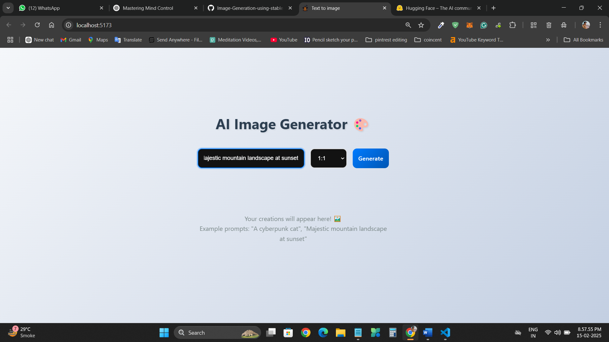
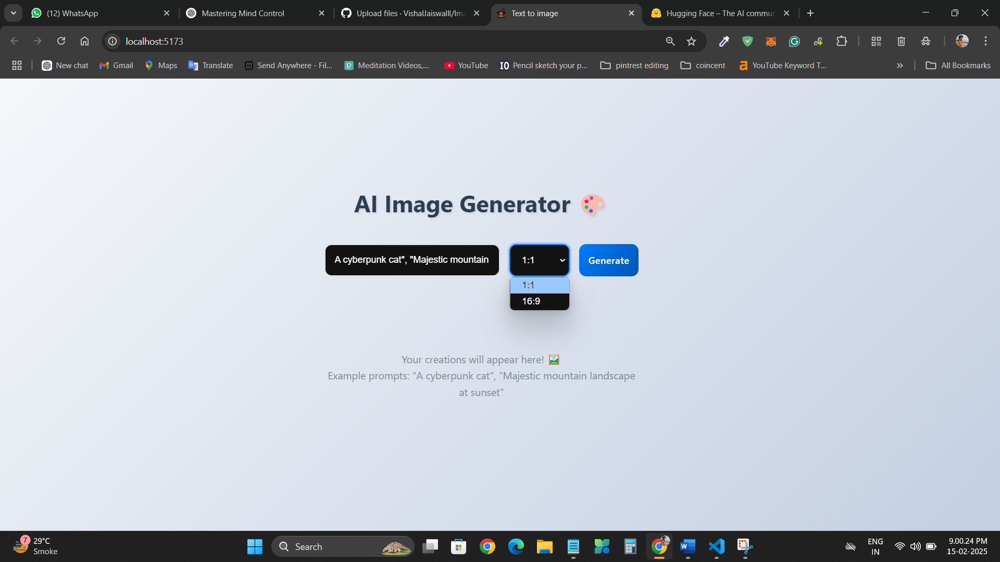
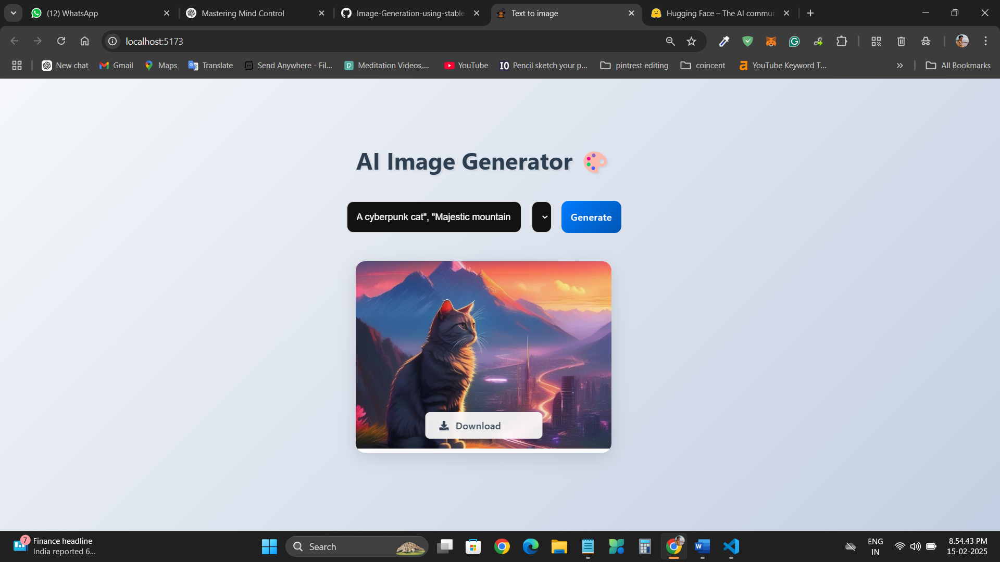

Image Generation Using Stable Diffusion

A web-based application for generating high-quality AI-generated images using Stable Diffusion.
This project leverages **React.js** for the frontend and **Node.js** for the backend, providing
an intuitive interface to generate, customize, and download AI-generated images.

 🚀 Features
- 🖼️ Generate AI-powered images with Stable Diffusion  
- 🎨 Customize prompts and model parameters  
- 💾 Download generated images  
- ⚡ Real-time image processing  

 🛠️ Tech Stack
- **Frontend:** React.js  
- **Backend:** Node.js  
- **AI Model:** Stable Diffusion  
- **API:** ComfyUI / Stable Diffusion API  

<p align="">
   <be><hr><br>
  <be><hr><br>
  <be><hr><br>
</p>

📌 Installation

1️⃣ Clone the Repository
```
https://github.com/VishalJaiswalll/Image-Generation-using-stable-diffusion.git
```

2️⃣ Install Dependencies
Frontend
```
cd client
npm install
npm start
```
Backend
```
cd server
npm install
node server.js
```
📷 Usage
Enter a text prompt for image generation.<br>
Adjust parameters like resolution.<br>
Click "Generate" to create an image.<br>
Download or save the generated image.<br>

📖 Future Enhancements<br>
🔹 Add authentication & user profiles<br>
🔹 Implement a gallery for saved images<br>
🔹 Support for multiple AI models<br>
🤝 Contributing<br>
Contributions are welcome! Feel free to fork the repo and submit a pull request.


📜 License<br>
This project is licensed under the MIT License.

